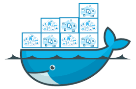
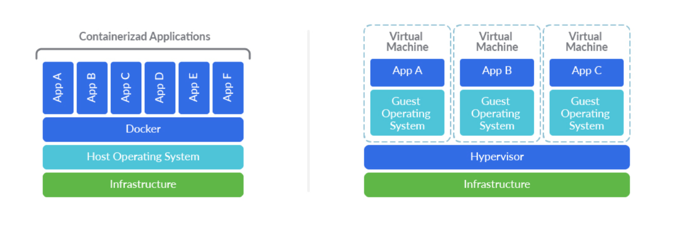

# Container Security Best Practices
## Saishiva K

---

# `$whoami`
* Senior Security Engineer @ Virsec Systems
* 5+ years of exp. in securing and pen-testing web, thick client, and containerized applications.
* I ❤️ python 
* [Twitter](https://twitter.com/saishiva_k), [LinkedIn](https://www.linkedin.com/in/saishiva-k-b6a30090/)

---
# Agenda
* Container Basics
* Securing Container Host
* Securing Container Images
* Monitoring Containers
* Tools
* Demo
---

# Basics
* What are containers?
* Difference between VM and Container
* Building blocks of container
* Security challenges
---
# Container Host Security
* Keep everything up to date - Host OS + Docker Enginee
* Do not expose Docker Daemon Socket
* Run Docker in Rootless Mode
* Avoid privileged containers
* Limit container resources
* Limit container capabilities
* Mount Containers’ Root Filesystems as Read-Only
---
# Container Image Security
* Scan container images for vulnerabilitites.
* Use minimal base image.
* Don't leak sensitive info to container images.
* Use multi stage builds
* Use fixed tags for immutability
* Create a USER for the container image
---
# Monitoring Containers

* Highly dynamic and ephimeral
* Pose visibility challenges with traditional monitoring solutions
* Use centralized location for storing metrics and logs
* Monitoring Tools
    * Prometheus & Grafana
    * Sematext
    * Solarwinds
    * Dynatrace
    * Datadog
---
# Tools 
* [Docker Bench for Security](https://github.com/docker/docker-bench-security)
* [Trivy](https://github.com/aquasecurity/trivy)
* [Semgrep](https://github.com/returntocorp/semgrep)
---
# Demo
---
# References
* https://cheatsheetseries.owasp.org/cheatsheets/Docker_Security_Cheat_Sheet.html
* https://blog.aquasec.com/docker-security-best-practices
* https://sysdig.com/blog/dockerfile-best-practices/

---
# Q & A
---
# Thank you!

